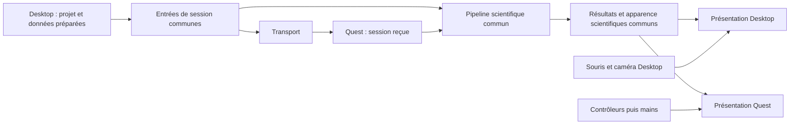

# Architecture cible proposée

## Composition du projet

Conserver Assets/Scripts/HBP et la scène HiBoP.unity. Ajouter une scène
QuestBootstrap avec un prefab de rig, un prefab de visualisation manipulable
et un panneau de connexion. Le contenu dynamique (meshes/buffers reçus) est
attaché à ces prefabs ; aucun GameObject UI construit pour combler des références
manquantes.

Un manifeste stable inclut les dépendances Desktop et l'ensemble XR nécessaire.
Les versions déjà déclarées dans XR sont des points de départ testés : Input
System 1.20.0, XRI 3.6.0, OpenXR 1.18.0, XR Management 4.7.0, Meta OpenXR 2.4.1.
Garder les dépendances transitives requises par passthrough ; ajouter les fonctions
mains à leur jalon. Vérifier la résolution de l'union au lieu d'annoncer une
compatibilité complète sur la seule égalité URP.

| Configuration | Desktop Windows puis macOS/Linux | Quest |
| --- | --- | --- |
| Scène | HiBoP.unity | QuestBootstrap.unity |
| Profil | DesktopWindows, puis DesktopMac et éventuel Linux | Quest |
| Identité de composition | HIBOP_DESKTOP | HIBOP_QUEST |
| Runtime XR | Aucun loader actif ni initialisation | OpenXR Android / Meta passthrough |
| Entrée | Navigation historique conservée | Actions Input System/XRI, contrôleurs |
| Rendu | URP Desktop actuel | Réglages URP Quest et stéréo |
| Natif | Plugins de l'OS/architecture | Android ARM64 uniquement |
| Données | Sources et import Desktop | Session préparée reçue |

Les Build Profiles portent scènes, defines et overrides Player lorsqu'ils sont
disponibles. Les réglages XR restent configurés par cible. Un validateur de
composition vérifie les valeurs effectives, car tous les paramètres ne sont pas
nécessairement indépendants dans le profil. Le changement d'Input System doit
faire l'objet d'un essai : conserver l'entrée historique Desktop, activer la
nouvelle entrée Quest et éviter une bascule globale cassant la souris. Ne pas
réécrire silencieusement le manifeste selon la plateforme.

Unity documente les scènes, defines et overrides des profils dans
[Build Profiles](https://docs.unity3d.com/6000.0/Documentation/Manual/build-profiles-reference.html).
L'initialisation XR est un réglage distinct :
[XR Plug-in Management](https://docs.unity3d.com/Packages/com.unity.xr.management@4.5/manual/EndUser.html).
Ces références Unity 6.0 / XR 4.5 expliquent le mécanisme ; les valeurs exactes
doivent être vérifiées dans l'éditeur 6000.5.2f1 et les packages effectivement résolus.

## Frontière comportementale

Le diagramme décrit des dépendances de code : le pipeline est exécuté dans chaque
Player, pas un service partagé en réseau. Les résultats locaux Quest ne deviennent
pas des pixels autoritaires pour Desktop.

Le snapshot de transfert est une représentation versionnée du sous-ensemble
préparé. Il ne doit pas devenir un deuxième modèle métier avec des règles,
valeurs par défaut et validations scientifiques divergentes.

## Extraction minimale proposée

Créer dans Core, au voisinage des wrappers, une tranche de calcul recevant les
entrées explicites nécessaires à DensityGenerator puis IEEGGenerator. Les noms
suivants décrivent les responsabilités ; ils ne figent pas une API :

- PreparedColumnInputs : références de volume/surface, sites ordonnés, masques,
  amplitudes préparées et paramètres scientifiques existants.
- ColumnProjectionSession : propriété des ressources, préparation de grille,
  binding de surface, calcul, normalisation et extraction des résultats.
- SiteAppearance : calcul commun de couleurs/tailles et règles de visibilité
  scientifique déjà présentes dans Column3DDynamic.

La tranche réutilise les wrappers actuels ; elle ne réimplémente pas les
algorithmes natifs. Elle reçoit les préférences nécessaires comme paramètres,
sans consulter Module3DMain, Camera.main, toolbar, transport ou Quest.

Desktop passe par cette tranche au jalon densité, puis iEEG, avec tests avant/après.
Les autres modalités restent dans leur chemin actuel. La branche scientifique
redondante n'est retirée qu'après validation Desktop, dans la même tranche.
Aucune migration générale des namespaces ou des singletons n'est requise.

Le premier cerveau manipulable ne doit pas attendre cette extraction :
il peut afficher la surface préparée reçue sans calcul scientifique local.

## Présentations indépendantes

Quest possède un parent spatial local pour translation, rotation et échelle
uniforme positive. Les surfaces et sites utilisent le même repère anatomique et
la même conversion d'unités. Le parent spatial ne modifie jamais les entrées de
hbp_core. Prévoir un recentrage accessible aux contrôleurs ; placement initial
et bornes de taille sont des réglages UX à essayer sur appareil.

Desktop garde sa caméra et ses vues. La frontière scientifique commune est
nécessaire ; un contrôleur spatial commun aux deux expériences ne l'est plus.

Les différences de shaders/instancing/stéréo sont des adaptateurs de présentation.
Les règles de normalisation, seuils, couleur scientifique, masque et sampling
restent communes. Si un renderer XR consomme déjà une couleur, il ne doit pas
la recalculer avec une autre règle.

## Frontières de plateforme limitées

- Source de session : préparation depuis le modèle chargé ou réception réseau.
- Résolution des fichiers de session : chemin local vérifié pour un volume natif.
- Composition XR/Desktop et réglages de rendu.
- Entrée spatiale et navigation Desktop.
- Transport et cycle de connexion, sans couplage au cycle de vie des données.
- Sélection des plugins par import settings.

Pas de IPlatformService global. Pas de file picker Quest tant qu'aucune fonction
ne demande d'import local. Pas de démarrage des managers de projet Desktop pour
charger une session Quest.

## Assemblies et isolation

Conserver Core, Data, Rendering, Theme et UI. Placer le code Quest dans une
assembly ciblée ; l'éditeur doit pouvoir l'importer pour Android. Placer la
liaison Desktop de transfert dans une assembly adaptée, distincte des contrats.
Réutiliser les packages purs existants uniquement pour les types sélectionnés.

Les nouvelles dépendances descendent vers Core/contrats. Elles ne remontent
jamais de Core vers les adaptateurs. Une vérification de graphe et une vérification
des types du seam extrait protègent cette règle. Les références Theme/UI historiques
de Data ne justifient pas un découpage massif avant le prototype.

L'exclusion de packages natifs, scènes et assets est démontrée par Build Reports
et inspection des Players. Ne pas supposer que les Resources Desktop disparaîtront
automatiquement ; inventorier le coût réel, traiter seulement les inclusions
bloquantes ou incompatibles à ce stade.

## Transport : proposition technique à qualifier

Préférence utilisateur : tout embarquer dans Unity si cela convient ; conserver
un auxiliaire seulement si un avantage concret le justifie.

Premier candidat : transport de flux chiffré embarqué, framing versionné borné,
chunks vérifiés par hash, échanges asynchrones. Un essai TcpListener/SslStream
ou d'un serveur embarqué compatible doit prouver les APIs effectivement utilisables
dans les Players, le cycle arrêt/reprise et le pinning sur IL2CPP. Aucun choix de
bibliothèque n'est réputé validé par ce document.

Pour le transfert ponctuel, HTTPS + WSS n'est pas un impératif : une seule connexion
de transfert peut suffire. Ne pas écrire une pile HTTP ou une cryptographie maison.
Limiter l'essai à appairer, transférer MNI, interrompre et reprendre. Si les APIs
TLS/serveur Unity imposent un contournement fragile ou un coût disproportionné,
revoir le choix avec les mesures et réutiliser l'auxiliaire P06 adapté.

Le sidecar P06 de repli n'effectuerait aucun calcul métier. Son intégration doit
relier un snapshot réel Desktop au serveur et gérer son cycle de vie ; il n'est
pas un serveur HiBoP prêt à l'emploi. Mac/Linux n'ont pas été validés nativement.
