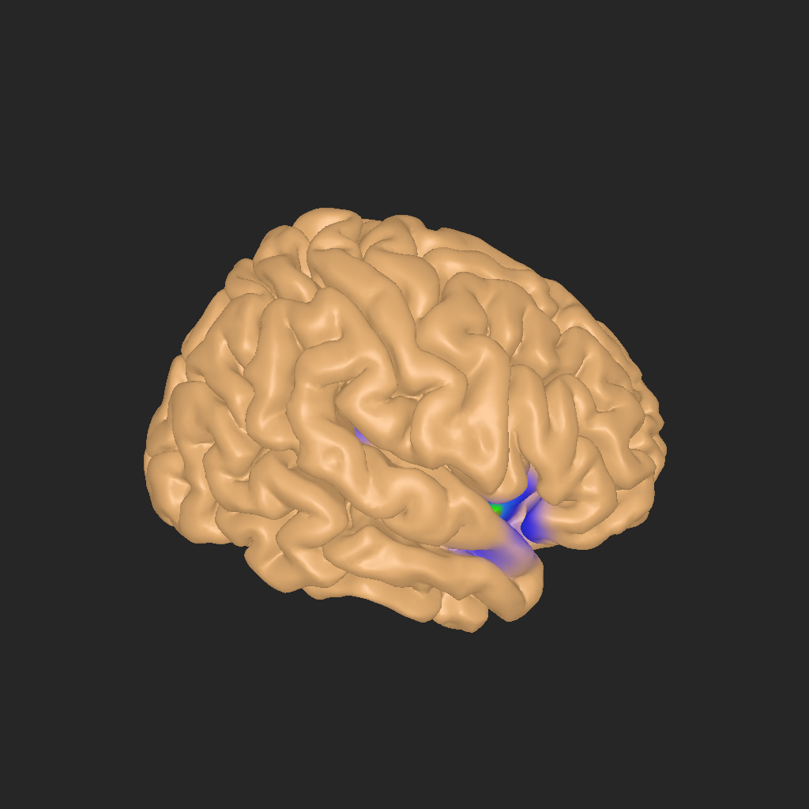

# Rapport QUEST-018 — Projection native réutilisable et préparation commune

## Résultat

La densité utilise directement les wrappers natifs existants :
`ActivityProjectionGrid.Create`, `ActivityGenerator.Initialize`,
`SurfaceGenerator.Initialize`, `DensityGenerator.ComputeActivity` et
`SurfaceGenerator.ComputeActivityUV`. La classe `DensityProjection` et les méthodes
`BindDensityGrid` / `BindDensitySurface` ont été supprimées. La densité reste propre
aux colonnes anatomiques ; la création de grille et le binding de surface sont
communs à toutes les modalités. Le calcul scientifique et sa normalisation restent
dans `hbp_core`, inchangé.

`Column3D.PrepareActivityComputation` prépare sur le thread Unity deux opérations :
`Compute`, exécutée sur le worker, et une éventuelle `Publish`, exécutée au retour
sur Unity si la colonne existe encore. Anatomie, iEEG/CCEP, statique, fMRI et MEG
spécialisent cette préparation. La scène exécute le même chemin pour chaque colonne,
sans sélection de modalité par une chaîne de tests de types.

Les workers utilisent uniquement leurs entrées capturées. Les drapeaux de scène,
la progression, les événements et la publication de consommation mémoire restent
sur le thread Unity. Les changements de calibration et de visibilité des valeurs
extrêmes sont différés pendant un calcul et appliqués au retour, avec les dernières
valeurs utilisateur. Les entrées détachées renvoient `UniTaskVoid` ; leurs opérations
internes renvoient `UniTask` et sont attendues, y compris le suivi de progression.

## État et provenance

- Implémentation : **IMPLEMENTEE** ; technique : **REUSSI** ; manuel : **VALIDE**.

- Branche `feature/xr-autonomous`, HEAD initial `28e858495041217931e1d2b938b8d87ef6639b5b`, checkout initial propre.
- Changements locaux non commités ; aucun push, CI distante ou opération sur casque.
- Unity `6000.5.2f1`, profil `Assets/Settings/BuildProfiles/DesktopWindows.asset`.
- Natif inchangé, provenance `Tools/NativePlugins.lock.json`, source hbp_core `ffb7686011f37a21e6c5ab4f88ad6cfcbc53ffc1`.
- Dépendance [QUEST-017](QUEST-017.md) : capture HBNA v3 réelle de MNI avec huit contacts synthétiques ; cette tâche ne qualifie pas le calcul Quest.
- [Manifeste](../evidence/QUEST-018/manifest.json). Les Players, logs et captures volumineux restent locaux sous `.artifacts/quest-018` et `.test-results/quest-018`.
- Pas de reprise historique XR, de prefab modifié ou de nouveau bouton. Les autres modalités partagent désormais la préparation et la gestion du worker.

## Points de code à revoir

- [ActivityProjectionGrid.Create](../../../../Assets/Scripts/HBP/Core/DLL/Generators/ActivityProjectionGrid.cs) et [SurfaceGenerator.Initialize](../../../../Assets/Scripts/HBP/Core/DLL/Generators/SurfaceGenerator.cs) : les opérations réutilisables restent dans les wrappers existants.
- [Base3DScene](../../../../Assets/Scripts/HBP/Data/Module3D/Base3DScene.cs) : `UpdateProjectionResources`, `ComputeGeneratorsAsync`, `LoadActivityAsync`, paramètres différés et nettoyage.
- [Column3D](../../../../Assets/Scripts/HBP/Data/Module3D/Column3D.cs) : contrat `PrepareActivityComputation`, capture des masques et durée de vie ; [RawSiteList.UpdateMasks](../../../../Assets/Scripts/HBP/Core/DLL/Electrodes.cs) valide avant mutation.
- Préparations spécialisées : [anatomie](../../../../Assets/Scripts/HBP/Data/Module3D/Column3DAnatomy.cs), [dynamique](../../../../Assets/Scripts/HBP/Data/Module3D/Column3DDynamic.cs), [CCEP atlas](../../../../Assets/Scripts/HBP/Data/Module3D/Column3DCCEP.cs), [statique](../../../../Assets/Scripts/HBP/Data/Module3D/Column3DStatic.cs), [fMRI](../../../../Assets/Scripts/HBP/Data/Module3D/Column3DFMRI.cs), [MEG](../../../../Assets/Scripts/HBP/Data/Module3D/Column3DMEG.cs).
- [Tests natifs et préparations](../../../../Assets/Tests/EditMode/HBP.Transfer.Anatomy.Desktop.Tests/DensityProjectionTests.cs), [tests des sorties asynchrones](../../../../Assets/Tests/EditMode/HBP.Transfer.Anatomy.Desktop.Tests/DesktopAnatomyCaptureTests.cs) et [diagnostic Player](../../../../Assets/Scripts/HBP/Dev/DensityProjectionDiagnostic.cs).

L’extension de la préparation à toutes les modalités est explicitement demandée
par le propriétaire dans cette correction. Elle conserve leurs appels scientifiques,
sans entreprendre les futures tâches de restructuration scène/colonnes.

## Entrées capturées et durée de vie

| Entrée / opération | Contrat |
| --- | --- |
| Grille | Scène propriétaire ; factory générique avec nettoyage si initialisation échoue. `ActivityGenerator.Initialize` pour toutes les colonnes. |
| Surface | `SurfaceGenerator.Initialize(generator, surface, min, max)` combine binding, UV principaux et UV nuls pour toutes les colonnes. |
| Masques | Copie des masques effectifs sur Unity, validation du nombre avant mutation native via `RawSiteList.UpdateMasks`. |
| Anatomie | Capture du générateur, des sites, de la distance et de la règle d'influence ; calcul de densité natif. |
| iEEG / CCEP / statique | Références des tableaux de valeurs, dimensions, nombre de sites, distance et calibration capturés. Les constructeurs internes remplacent les tableaux ; aucune copie volumineuse ajoutée. |
| CCEP atlas | Sélection et compatibilité du mesh évaluées sur Unity ; capture du masque de régions, de l'atlas et des valeurs. Le cas incompatible conserve son avertissement et ignore le calcul. |
| fMRI / MEG | Liste des paires volume/masque matérialisée avant le worker, calibration et valeurs masquées capturées. |
| Publication mémoire | Métriques du calcul terminé et taille du tableau capturé ; publication sur Unity, uniquement si colonne vivante. |
| Fermeture / destruction | Sites/générateurs possédés par les colonnes, grille/coupes par la scène ; libération après le même marqueur de terminaison réelle, sans annulation de cette attente. |

Les tableaux et handles sont empruntés jusqu'au retour de `Compute` : ils ne doivent
être ni mutés ni libérés simultanément. La fermeture normale attend les calculs avant
de décharger les volumes et surfaces des managers. Une annulation de l'observateur
n'implique pas la fin du calcul natif. Aucun gestionnaire global de leases ou de
cancellation native n'est introduit.

La revue indépendante ciblée sur concurrence et durée de vie n'a identifié aucun
défaut concret dans cette correction ; elle est complétée par les tests ci-dessous.

## Vérifications effectuées

| ID | Scénario | Résultat / preuve |
| --- | --- | --- |
| T1 | CLI EditMode Windows, filtre Desktop + ActivityProjectionPhase3 + Stage5ProjectionBuffer + ActivityProjectionSettings ; [arguments exacts](../evidence/QUEST-018/editmode-command.json) | REUSSI, exit 0, **57/57**, aucun ignoré ; [XML](../evidence/QUEST-018/editmode.xml). |
| T2 | Avant/après, aucun site, un site, huit sites avec exclusions, tous masqués ; Nearest/Trilinear, Constant/Linear/Quadratic, rayons 15 → 25 → 15 mm, alpha 0/0,8/1 | REUSSI dans T1 : égalité exacte des valeurs MaxDensity, ActivityUV, AlphaUV et couverture ; UV finis, maximum nul pour aucun site/tous masqués ; retour au résultat initial. |
| T3 | Capture Desktop MNI complète de QUEST-017, huit contacts, grille 80 Trilinear, influence Quadratic | REUSSI dans T1 : comparaison de tous les UV de la surface préparée, sans sous-échantillonnage. |
| T4 | Changement de grille, rebinding de surface, masque incohérent, capture d'entrées Desktop | REUSSI dans T1 : binding invalidé, grille initiale restaurable ; masque incohérent rejeté sans mutation ; changements UI après capture sans effet sur le calcul déjà préparé. |
| T5 | Worker natif retenu par barrière asynchrone, annulation réelle de son observateur, succès/exception, demande de nettoyage | REUSSI dans T1 : attente externe annulée, handles encore vivants ; libération seulement après le `finally` du worker. Erreur et invalidation de `ComputeGeneratorsAsync` relâchent le drapeau et arrêtent la progression. |
| T11 | Préparations iEEG, CCEP sites, statique, fMRI et MEG, entrées modifiées après capture puis calcul sur worker | REUSSI dans T1 : parité UV/alpha avec appels natifs directs ; tableaux/dimensions/masques et listes de volumes capturés. Les callbacks de calibration différés sont aussi vérifiés sur erreur/invalidation. |
| T6 | CLI PlayMode Windows, assemblage `HBP.Module3D.PlayModeTests`, appareil graphique réel ; [arguments](../evidence/QUEST-018/playmode-command.json) | REUSSI, exit 0, **45/45**, aucun ignoré ; [XML](../evidence/QUEST-018/playmode.xml). Calcul de densité/coupes, changement de surface sans recalcul, grille et fermetures répétées. |
| T7 | `Tools/Build-QuestConnectionPlayers.ps1 -Target Windows -EvidenceId quest-018` | REUSSI, exit 0, Player Windows IL2CPP final ; chemins et hashes dans le manifeste. |
| T8 | Player final sur `quest-mni-contacts.hibop`, `-v "MNI Contacts" -densityEvidence .../density-capture-revision` ; [arguments](../evidence/QUEST-018/player-command.json) | REUSSI, trois recalculs via la vraie scène et contrôle de l'upload ; [résultat](../evidence/QUEST-018/player-result.json), références [15 mm](../evidence/QUEST-018/reference-15mm.png) et [25 mm](../evidence/QUEST-018/reference-25mm.png). |
| T9 | Inspection des wrappers Core.DLL et des appels Desktop ; comparaison du diff natif | REUSSI ; [contrôles](../evidence/QUEST-018/seam-check.json), aucune dépendance vers Data/UI/Quest/Transfer ni vers les singletons Desktop dans les wrappers Core.DLL. |
| T10 | `Tools/format-code.cmd`, `git diff --check`, contrôle des liens et du manifeste | REUSSI, formatage des quatorze C# modifiés, puis diff sans erreur. |

Les trois calculs Player produisent **69 104/69 104 sommets couverts**, avec huit
sites actifs. La densité maximale vaut **1,34160924 → 1,58352613 → 1,34160924**
pour **15 → 25 → 15 mm**. Les deux PNG à 15 mm ont le même SHA-256 ; celui à
25 mm est différent. L'agent a inspecté les images : cerveau visible, zone de
densité élargie à 25 mm, référence à 15 mm restaurée. Les UV du mesh Unity sont
égaux à ceux du générateur à chaque étape. Les durées incluent attente de frames et export PNG ; ce ne sont pas des benchmarks du noyau natif.

Ces références visuelles proviennent du **nouveau Player**, dont les valeurs ont
été comparées à l'ancien enchaînement dans T1/T3. Il ne s'agit pas de captures d'un
ancien binaire. Le propriétaire a validé leur apparence dans M1 le 2026-09-09.

Le Player de diagnostic a été arrêté explicitement après collecte ; son PID et
son chemin ont été vérifiés, puis l'absence du PID confirmée dans la [preuve d'arrêt](../evidence/QUEST-018/player-stop.json).
Le diagnostic annonce son résultat par JSON ; aucun exit code 0 du Player n'est
revendiqué, car la fermeture interactive de HiBoP demande une confirmation.

Le premier essai du diagnostic avait produit des captures noires en lisant une
RenderTexture non rendue et un JSON vide par sérialisation de types anonymes sous
IL2CPP. Corrigé en utilisant `View3D.GetTexture` et `JObject` explicite, puis
reconstruit et réexécuté. Les premiers artefacts restent locaux comme traces de
développement, sans servir de preuve finale. Les erreurs de compilation et l’initialisation incomplète des masques des nouvelles fixtures ont été corrigées avant la dernière exécution de T1. Le build émet les avertissements
Unity/analyzers existants ; le Player final n'a pas journalisé d'exception. Le
message de buffer graphique saturé figure dans les essais locaux, sans échec de
l'export final.

La première restauration NuGet du formateur était bloquée par le réseau sandbox ;
le formateur a ensuite réussi hors sandbox. Les changements générés par Unity
(BuildInfo, préfiltrage URP/OpenXR et paramètres Player) sont sauvegardés dans
`.test-results/quest-018/revision/unity-generated.patch` puis retirés du diff livré.

Les comparaisons exactes établissent une erreur numérique maximale et RMS de zéro
pour les valeurs comparées dans ces essais sur le même runtime Windows. Ce n'est
pas une tolérance de parité Windows/Android. La classification et le nombre de
sommets couverts sont comparés ; les durées et compteurs internes du cache n'ont
pas à être identiques.

## Validation manuelle du propriétaire

Player à utiliser :
`C:\HBP\Software\HiBoP\.artifacts\quest-018\Windows\HiBoP.6.1.0.win64\HiBoP.exe`.
Fixture : `C:\HBP\Software\HiBoP\.artifacts\quest-018\fixture\quest-mni-contacts.hibop`.
Elle contient le MNI du dépôt et huit contacts synthétiques, sans EEG ni patient réel.
Depuis PowerShell, ouvrir la fixture avec :

```powershell
& 'C:\HBP\Software\HiBoP\.artifacts\quest-018\Windows\HiBoP.6.1.0.win64\HiBoP.exe' -pf 'C:\HBP\Software\HiBoP\.artifacts\quest-018\fixture\quest-mni-contacts.hibop' -v 'MNI Contacts' -screen-fullscreen 0
```

1. **M1 — VALIDE le 2026-09-09.** Dans la visualisation « MNI Contacts », afficher la projection avec le bouton de calcul de l'onglet « Activity » (objet `Compute IEEG` du prefab `Assets/Prefabs/3D/UI/3D Menu.prefab`, composant `ComputeActivity`). Comparer les zones de densité à la [référence à 15 mm](../evidence/QUEST-018/reference-15mm.png), également visible ci-dessous. Le cerveau et les contacts doivent rester aux mêmes positions ; aucune nouvelle UI.
2. **M2 — VALIDE le 2026-09-09.** Menu **Edit → Preferences**, section **Visualization → 3D**, champ **Site influence by distance** : noter la valeur initiale, choisir une autre règle (par exemple Quadratic → Linear), valider avec **OK**, puis recalculer avec le même bouton. Revenir à la règle initiale, valider et recalculer : retrouver la densité initiale. Le rayon anatomique de 15 mm ne dispose pas du champ Desktop des colonnes iEEG ; le diagnostic automatisé couvre séparément son aller-retour 15 → 25 → 15 mm. Aucune UI n'a été ajoutée pour la recette.

Retour du propriétaire dans cette conversation le **2026-09-09**, après lancement du Player ci-dessus sur « MNI Contacts » : **« Je valide M1 et M2 »**. Cette confirmation explicite valide les deux gestes ; elle est distincte des résultats automatisés.



## Décisions, limites et suite

La vérification manuelle visuelle reste distincte des assertions automatiques.
La correction ne modifie pas les algorithmes scientifiques, l’UI ou le code natif.
Le build Android et le calcul physique au casque ne sont pas exécutés dans cette tâche Desktop. Les nouvelles préparations iEEG, CCEP sites, statique, fMRI et MEG sont testées ; la préparation CCEP atlas a été revue sans ajout d’un essai sur jeu de données atlas réel. Ces contrôles ne constituent pas une requalification scientifique exhaustive des modalités.

QUEST-018 est terminée : implémentation et vérifications techniques réussies, M1/M2 validées par le propriétaire. QUEST-019, calcul local Quest, reste hors de cette implémentation.
