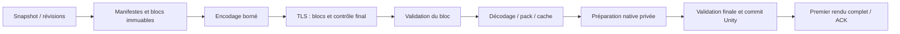

# Plan d’optimisation du transfert Desktop → Quest

Date : 16 septembre 2026. Référence : `visu_full_test / Small`.
Statut : proposition d’implémentation, fondée sur deux mesures physiques et
une inspection du code C#/C++. Aucun gain proposé ci-dessous n’a encore été
mesuré après optimisation au moment de la rédaction initiale. Aucun changement
de production dans cette analyse initiale.

Suivi d’exécution : [lots 0 et 1 mesurés](QUEST-transfer-result-03-lots-0-1.md),
[lot 2 — pack indexé et références compactes](QUEST-transfer-lot-2.md).
La [mesure du lot 2](QUEST-transfer-result-04-lot-2.md) donne 59,914 s, sans anomalie,
avec sept entrées ZIP ; le palier de 30 s reste à atteindre.
Le [lot 3 — snapshot détaché, workers et caches](QUEST-transfer-lot-3.md)
est implémenté et [mesuré sur deux envois](QUEST-transfer-result-05-lot-3.md) :
41,374 s et 41,982 s après clic, plus 11,536 s de préparation initiale anticipée.
Les caches fonctionnent. Le préchargement Desktop bloquant à Pair identifié dans
ce benchmark a été corrigé : ressources privées chargées sur worker, publication
sur Unity, fermeture protégée et lectures GIFTI sérialisées. **Lot 3 clôturé** après
90 tests automatisés et deux builds Release réussis. Aucun nouveau gain chronométré
n'est attribué à ce correctif sans benchmark physique ; les mesures ci-dessus
restent celles des players antérieurs au correctif. Détails et artefacts dans le
[bilan de clôture](QUEST-transfer-lot-3.md).
Le [lot 4 — Zstd natif et pipeline HBT4](QUEST-transfer-lot-4.md) est
implémenté : 102 tests EditMode, 8 scénarios PlayMode et deux builds Release
validés, avec autotests IL2CPP réussis sur les deux players. Le
[benchmark physique du lot 4](QUEST-transfer-result-06-lot-4.md) confirme
**20,027 / 20,241 s**, environ **52 % de moins** qu'au lot 3, sans anomalie
signalée. Les caches fonctionnent et le gel Desktop à Pair est corrigé.
Préparation initiale distincte : 9,314 s Desktop + 5,371 s Quest.
**Performances du lot 4 acceptées par l'utilisateur.** La cible réseau + 3–5 s
reste non atteinte, avec 8,4–8,8 s après réception, mais ne bloque pas la clôture.
Les [optimisations futures](QUEST-transfer-future-optimizations.md) sont
documentées et reportées. Le lot 5 réunit fusion native, retrait de
l'instrumentation détaillée, validation finale Release et bilan avant/après,
sans nouveau chantier de performance. **Lot 5 clôturé** : fusion native et retrait
des sondes réalisés, 169 tests Unity réussis (deux autres ignorés), 16 tests natifs,
deux builds Release validés. L'unique envoi final Wi-Fi prend **24,769 s**, avec
Small complète et utilisable, sans anomalie signalée ni nouvelle trace détaillée.
Ce résultat est plus lent que le lot 4 ; la cause n'est pas établie et aucune
absence de régression de performance n'est revendiquée. Voir le
[bilan final du lot 5](QUEST-transfer-final.md).
Les cibles ci-dessous restent des objectifs ; consulter ces rapports pour les
résultats effectivement obtenus et les validations.

## 1. Décision proposée

**Une réduction de plusieurs fois du délai est une cible crédible.** Le système
actuel consacre une grande partie de son temps à matérialiser de petits fichiers,
les rouvrir, recalculer des empreintes et reconstruire un graphe d’objets généraliste.
Ces coûts ne constituent pas une limite physique du Quest.

**Recommandation : viser d’abord moins de 30 s, puis un délai proche du transfert
utile augmenté de 3 à 5 s**, pour un envoi complet de Small, application déjà prête
mais sans cache du contenu envoyé. Une cible de l’ordre de **10 à 20 s** mérite
d’être poursuivie ; c’est un objectif d’ingénierie conditionnel, pas une prévision
garantie. Un Quest qui reçoit déjà toutes les ressources en cache peut faire
beaucoup mieux, mais ce sera un scénario distinct.

Pour y parvenir, je recommande cet ordre :

1. Supprimer les allocations et vérifications répétées évitables, sans modifier
   les données scientifiques ni affaiblir les contrôles.
2. Regrouper les buffers dans un stockage binaire indexé ; supprimer les milliers
   de fichiers et les références JSON inutilement répétées.
3. Accélérer et décaler hors du thread Unity le travail de restauration qui peut
   l’être ; limiter le travail de publication à l’application d’objets prêts.
4. Mettre en cache les ressources immuables et leurs représentations préparées.
5. Si le délai restant le justifie, faire fonctionner encodage, réception,
   décodage et préparation en pipeline à mémoire bornée.

Le pipeline complet n’est pas le premier chantier : il doit reposer sur un format
et des durées de vie maîtrisés. Une étape intermédiaire **ZIP + pack de buffers**
permet de gagner sans changer simultanément tout le protocole.

## 2. Ce que les benchmarks démontrent

Sources : [essai USB](QUEST-transfer-baseline-01.md),
[essai Wi-Fi](QUEST-transfer-baseline-02-wifi.md),
[instrumentation](QUEST-transfer-instrumentation.md),
[optimisations précédentes](QUEST-030-capture-freeze.md).

### 2.1 Chemin critique actuel

L’architecture attend successivement la capture, l’archive complète, son envoi
complet, son extraction complète, sa désérialisation puis sa restauration.
L’ACK signifie publication après préparation du rendu ; l’attendre 75 s n’est
donc pas un retard réseau inexpliqué.

| Étape | USB, premier chargement | Wi-Fi, deuxième envoi | Lecture |
| --- | ---: | ---: | --- |
| Capture Desktop complète | 24,10 s | 17,12 s | Anatomie manquante déjà chargée au deuxième envoi |
| Connexion + hash avant envoi | ≈ 1,07 s | ≈ 1,28 s | Un hash complet supplémentaire |
| Payload reçu sur Quest | 7,95 s | 11,81 s | Inclut hashes, TLS, attente et stockage |
| Extraction Quest | 23,11 s | 36,28 s | 48 553 entrées, très nombreux petits fichiers |
| Désérialisation Quest | 14,36 s | 16,84 s | Inclut les lectures des buffers |
| Restauration Quest | 26,49 s | 21,96 s | Cache standard utile, autres traitements ralentis |
| Total Desktop | 97,29 s | 105,53 s | Les sous-scopes ne s’additionnent pas |
| Plus grand intervalle entre frames Desktop | 2,85 s | 2,86 s | Snapshot synchrone |
| Plus grand intervalle entre frames Quest | 10,78 s | 16,46 s | Chargement/reconstruction sur le thread Unity |

Sur le Wi-Fi, le premier rendu CPU est situé entre **105,468 et 105,553 s**.
Environ **94 s** restent hors de l’intervalle de réception du payload dans
l’organisation séquentielle actuelle. Mais les 11,81 s de réception ne sont
pas non plus un plancher réseau : elles comprennent **6,857 s de SHA-256**.

Ces mesures ne sont pas une étude statistique. Plusieurs coûts locaux Quest
augmentent d’environ ×1,5 au deuxième passage, même après réception : ce n’est
pas imputable uniquement au Wi-Fi. Alimentation USB différente, fréquences,
température, mémoire et concurrence restent des explications possibles.
L’état thermique collecté après les essais ne tranche pas la question.

### 2.2 Volumes et structure des données

| Élément | Valeur |
| --- | ---: |
| Archive transmise | 143,195 Mo |
| Contenu décompressé | 413,780 Mo |
| Fichiers NIfTI, décompressés | 240,125 Mo |
| Buffers binaires uniques, décompressés | 139,275 Mo |
| Métadonnées JSON, décompressées | 34,380 Mo |
| Entrées ZIP | 48 553 |
| Entrées sous 4 Kio | 48 500 |
| Lectures numériques pendant désérialisation | 49 672 |
| Références globales résolues | 110 877 |

La somme des contenus compressés est **132,902 Mo**. La différence avec
l’archive, **10,293 Mo soit 7,19 %**, correspond à son enveloppe ZIP et aux
métadonnées associées, pas à des données scientifiques supplémentaires.
Regrouper les entrées peut donc aussi diminuer les octets transférés.

La déduplication actuelle économise **1,004 Mo sur 140,280 Mo de buffers demandés**,
soit **0,716 %**, pour 49 714 calculs/consultations de hash. Cela ne condamne pas
la déduplication, notamment entre transferts, mais relativise l’intérêt de
traiter chaque minuscule tableau comme un fichier adressé par SHA-256.

### 2.3 Trois découvertes importantes dans le code

**Le chargement IRM n’est pas du temps natif pur.** `Volume.LoadNIFTIFile`
calcule le SHA-256 avant et après `hbp_volume_load_nifti`, puis mémorise la
provenance. Le Quest a déjà vérifié les mêmes fichiers pendant l’extraction.
Les **14,187 s** de `quest.mri.nifti` mélangent donc deux hashes, lecture native,
conversion et calculs dérivés. À titre d’ordre de grandeur seulement, une passe
SHA des trois NIfTI coûte **5,591 s** à l’extraction ; deux passes comparables
représenteraient **11,182 s**. On ne peut pas déduire exactement le temps natif
par soustraction de scopes exécutés dans des conditions différentes.

**L’extraction alloue 64 Kio par entrée.** Avec 48 553 entrées, cela représente
**3,182 Go d’allocations cumulées**, sans compter les objets ZIP, fichiers et
hashes. Ce n’est pas une occupation simultanée de RAM. Un seul tampon par worker
suffirait à cette boucle. La trace enregistre 724 incréments de GC0 pendant le
décodage Wi-Fi ; elle ne mesure pas leur durée propre.

**Les petits fichiers sont payés deux fois.** Ils sont créés et vérifiés à
l’extraction, puis les tableaux sont rouverts pendant la désérialisation.
Les ouvertures seules coûtent **7,075 s** au deuxième passage, pour seulement
**22,029 Mo** lus par le convertisseur numérique. Les buffers de surfaces sont
lus par un autre chemin ; ne pas confondre ces 22 Mo avec tous les binaires.

## 3. Limites physiques et définition de l’objectif

### 3.1 Mesurer le bon coût réseau

Pour un débit utile réseau `R` et un volume compressé `B`, le coût de transport
idéal vaut `B / R`. Le débit radio annoncé de 866 Mbit/s n’est pas `R`.
Les **12,13 Mo/s** observés incluent le récepteur actuel, notamment ses hashes.
Un petit test automatisé de débit sur le même chemin TLS, vers un puits borné,
avec compteur de bytes et contrôle final, servira à estimer la capacité du
transport une fois les traitements lourds retirés. Ce test ne remplace pas
la validation d’intégrité du protocole de production.

Scénarios arithmétiques, **pas débits promis** :

| Débit utile supposé | Temps pour 143,195 Mo | Débit de traitement des 413,780 Mo bruts requis pour suivre |
| --- | ---: | ---: |
| 12,13 Mo/s | 11,81 s | 35,1 Mo/s |
| 25 Mo/s | 5,73 s | 72,2 Mo/s |
| 50 Mo/s | 2,86 s | 144,5 Mo/s |

Traiter quelques dizaines de Mo/s sans milliers de fichiers est une hypothèse
raisonnable à tester. Soutenir 144,5 Mo/s en ajoutant décodage, validation,
conversions et rendu sur ce Quest n’est pas acquis. Plus on accélère le réseau,
plus la cible « limitée par le transfert » devient exigeante.

### 3.2 Objectif du pipeline

Aujourd’hui, le délai ressemble à une somme. Dans un pipeline régulier :

```text
T ≈ capture initiale cohérente
    + max(production/encodage, transfert utile, décodage/préparation)
    + vidange des dernières dépendances + publication/rendu
```

Cette approximation suppose des blocs indépendants, assez de parallélisme et
pas de contention excessive. Si tous les workers saturent les mêmes cœurs ou
la bande passante mémoire, le `max` ne remplace pas magiquement la somme.

Le critère de succès sera : réseau effectivement alimenté sans longs trous,
traitements locaux capables de suivre son débit, et **3 à 5 s maximum de
travail exposé autour du transfert** comme première cible. Un critère plus
strict, après stabilisation, sera un délai local exposé ≤ 20 % de `B / R`,
avec un plancher pratique pour la publication. La fonction à minimiser reste
le temps utilisateur, pas le pourcentage de réseau dans le total.

### 3.3 Séparer les scénarios

- **Premier démarrage** : installation/vérification des références standard et
  premier chargement MNI. Les préparer à l’ouverture de l’application est utile,
  mais consigner ce temps de mise en route séparément.
- **Application prête, contenu absent** : cas principal pour prouver une
  accélération réelle d’un envoi complet. Ne pas annoncer comme gain universel
  une mesure réalisée uniquement avec le contenu déjà sur le Quest.
- **Contenu déjà en cache, paramètres changés** : transférer un delta peut
  atteindre quelques secondes, voire moins selon ce qui doit être republié.
  Le réseau peut alors cesser d’être dominant, ce qui est un bon résultat.

Préparer pendant que l’utilisateur travaille réduit la latence après clic,
mais déplace du travail. Mesurer à la fois ce temps anticipé et le temps exposé.
L’objectif conserve les ressources, colonnes, modalités et possibilités de
manipulation actuelles ; pas de résolution réduite ni de données omises en douce.

## 4. Optimisations par étape

### A. Préparation et snapshot Desktop — 17,12 s à chaud

**Actions immédiates.** Conserver la préparation d’anatomie réutilisable : son
coût passe déjà de 7,316 s à 3,5 ms. Anticiper le chargement des ressources
nécessaires lorsqu’une visualisation destinée au Quest devient stable, avec
annulation et budget mémoire. Ne pas attendre le clic pour découvrir toute
l’anatomie des patients si elle peut être préparée sans gêner l’utilisateur.

**Snapshot.** Le JSON prend 1,669 s sur le thread Unity, les ressources 1,171 s,
et les hashes/déduplication sont imbriqués dans la capture. Produire un snapshot
de données simples, propriétaire de ses buffers et références immuables, puis
faire sur worker la sérialisation, les empreintes et la compression. Copier
sur le thread Unity seulement ce qui dépend réellement des objets vivants.

La correction QUEST-030 avait délibérément figé les métadonnées synchroniquement :
les données des colonnes sont encore référencées depuis le graphe vivant.
**Déplacer simplement `CaptureMetadata` dans `Task.Run` serait incorrect.**
Il faut des révisions cohérentes et des copies ou des ressources réellement
immuables. Un snapshot fractionné sur plusieurs frames n’est valide que si
la révision reste la même ; sinon reprendre ou invalider la capture.

**Surfaces.** `AddSurface` clone une surface native, restaure son masque complet,
passe par un `Mesh` Unity puis recopie ses composantes. Préférer un export natif
vers buffers détenus, sans détour par un `Mesh` temporaire, après audit de la
représentation et de l’ownership. Séparer géométrie immuable et masques/configuration
variables permet de réutiliser la géométrie entre captures. Ne pas sacrifier
les versions simplifiées/inflées ou les hémisphères nécessaires à la parité.

**Cible** : sous 0,5–1 s de capture exposée, et aucun gel long ; cible à valider,
pas économie déduite du temps actuel. Découper le travail Unity en budgets de
quelques millisecondes par frame lorsque cela conserve un snapshot cohérent.

### B. Empreintes et provenance — coût transversal prioritaire

Il existe plusieurs garanties différentes : intégrité du transport, identité
d’une ressource, cohérence d’un fichier source et validité du cache persistant.
Les traiter séparément permet de supprimer les passages redondants sans les
confondre ni supprimer les vérifications.

| Emplacement | Coût Wi-Fi mesuré | Action |
| --- | ---: | --- |
| Hash final archive Desktop | 0,838 s | Produire/conserver l’empreinte d’un artefact finalisé |
| Rehash avant envoi | 1,074 s | Réutiliser cette empreinte sous ownership immuable |
| Hashes des chunks + du payload Quest | 6,857 s | Provider rapide, calcul en flux, protocole de blocs à terme |
| Hashes après extraction `.bin` + `.nii` | 15,321 s | Hasher pendant décodage ; éliminer réouverture/relecture |
| Hash des références standard à chaque scène | 4,831 s | Cache de validation lié à installation/manifeste |
| Deux hashes dans le chargement IRM | Inclus dans 14,187 s | Chemin interne pour ressource déjà vérifiée et détenue |

**D’abord mesurer le provider SHA.** `SHA256.Create()` ne prouve pas que
l’implémentation utilise efficacement le matériel sous IL2CPP Android.
Comparer sur les mêmes octets le provider actuel et une implémentation native
optimisée, embarquée et versionnée, avec détection des instructions disponibles
et chemin portable. Mesurer gros buffers et nombreux petits messages. Éviter
une transition JNI/PInvoke par petit scalaire et réutiliser les contextes.

**Le hash en flux ne supprime pas son temps CPU.** Il supprime surtout des
relectures, des ouvertures et la séparation en passes. Il faut donc aussi
traiter le nombre d’objets et l’implémentation du hash ; ne pas annoncer
15,321 s récupérées intégralement en changeant seulement la boucle d’extraction.

**Ressource vérifiée.** Introduire un contrat interne du type `VerifiedResourceLease` :
contenu vérifié, fichier privé finalisé, propriétaire unique, non réécrit pendant
sa vie, empreinte et taille connues, utilisateurs comptés. Un nom SHA, un booléen,
un timestamp ou la seule taille du fichier ne suffisent pas. Publication du cache
par fichier provisoire puis renommage atomique ; suppression seulement après
libération des lecteurs. Ne pas extrapoler les garanties de `FileShare.Read`
Windows aux ouvertures natives par chemin sur Android.

Le chargeur général de fichiers utilisateurs garde ses contrôles avant/après.
Le chargeur interne de ressources détenues peut réutiliser leur provenance.
Conserver la cohérence `.hdr/.img`, dont l’identité dépend des deux fichiers.
Définir aussi la revalidation après redémarrage/corruption du stockage : vérifier
les octets avant écriture ne prouve pas éternellement le contenu du disque.

**ZIP : piège à éviter.** Un SHA calculé naïvement sur les appels `Write` d’un
flux susceptible de `Seek` et de réécrire les en-têtes n’est pas le hash final.
Utiliser une sortie append-only/non-seekable validée, ou conserver un passage
final et supprimer seulement le deuxième. Ne modifier le protocole de hash
de bout en bout qu’avec une spécification et ses tests.

### C. Compression et enveloppe — 13,40 s Desktop

Le code utilise déjà `CompressionLevel.Fastest`. Descendre un réglage ne
suffira donc pas. Les milliers de créations/finalisations d’entrées et leur
compression indépendante empêchent aussi de partager les redondances voisines.

**Étape intermédiaire recommandée :** garder ZIP et le transport actuel, avec
un `buffers.pack` contigu, un index, les métadonnées et les quelques fichiers
natifs. Décompresser le pack une seule fois vers un fichier seekable, puis lire
ses plages, sans recréer un fichier pour chaque tableau. Ne pas chercher des
plages arbitraires dans une entrée Deflate encore compressée.

**Étape suivante si nécessaire :** blocs indépendants de taille bornée,
initialement entre 256 Kio et 1 Mio à comparer, codec identifié par bloc.
Décompresser un bloc à la demande ou pendant sa réception. Un petit cache de
blocs borne la RAM ; l’index relie ressources logiques, blocs et plages.

Comparer sur le corpus réel : pack + Deflate actuel, LZ4, Zstd à faible niveau,
et blocs bruts pour contenu incompressible. LZ4 offre des blocs indépendants ;
les blocs dépendants peuvent améliorer le ratio mais limitent accès indépendant
et parallélisme ([spécification LZ4](https://github.com/lz4/lz4/blob/dev/doc/lz4_Frame_format.md)).
Zstd offre un compromis paramétrable vitesse/ratio et des dictionnaires pour
petites données ; ne pas entraîner un dictionnaire avant d’avoir évalué le
regroupement ([projet Zstandard](https://github.com/facebook/zstd)). Les chiffres
publics de ces projets ne prédisent pas ceux de ce Quest.

Le critère est `temps encodage + bytes / débit + temps décodage` pour un chemin
séquentiel, puis le coût de l’étage limitant pour un pipeline. Par exemple,
20 Mo supplémentaires coûtent 1,65 s à 12,13 Mo/s : un codec qui économise bien
plus de CPU peut être préférable malgré un ratio inférieur. À l’inverse,
envoyer les 413,8 Mo bruts coûterait environ 34,1 s à ce débit supposé :
**supprimer toute compression n’est pas la recommandation**.

### D. Extraction et stockage — 36,28 s Quest

**Sans changement de format :** tampon réutilisé, SHA pendant la lecture,
réutilisation des objets appropriés, validation des identités une fois à
l’entrée plutôt que répétition de `GetFullPath`/parsing de noms à chaque usage.
Ne pas enlever les contrôles de chemin : produire un index validé dont les
consommateurs n’acceptent plus de chemins externes arbitraires.

**Avec le pack :** passer de dizaines de milliers de créations/ouvertures à
quelques fichiers persistants et des lectures par offset. Garder de vrais
fichiers uniquement pour les API natives qui en ont encore besoin, notamment
NIfTI et leurs éventuels compagnons. Les écritures chronométrées `.bin` ne
prennent que 0,154 s : le problème est l’ensemble fichiers/métadonnées/validation/
allocations, pas une preuve que le support de stockage débite trop lentement.

Le gisement est le scope de 36,28 s, **pas une promesse de supprimer 36 s**.
Les bytes doivent encore être décodés, vérifiés et consommés. Une première
cible est de ramener cette étape à quelques secondes, avec un nombre d’opérations
fichiers proportionnel aux gros objets/blocs plutôt qu’au nombre de tableaux.

### E. Métadonnées et tableaux — 16,84 s Quest

**Premier gain sans refonte du graphe :** le convertisseur numérique lit le
pack par plage. Lire les composantes en bloc vers des buffers little-endian,
avec bornes et validation, plutôt qu’un appel `BinaryReader` par valeur.
Les contrôles de dimensions, finitude et indices restent obligatoires quand
ils existent aujourd’hui. Les surfaces profitent du même traitement : leur
décodage coûte 2,237 s, dont seulement 0,580 s d’upload natif mesuré.

**Ensuite un contrat de transfert explicite.** Réduire les 34,4 Mo de JSON :
table de types autorisés, identifiants compacts de ressources et références
globales, tables d’objets/canaux/essais, tableaux contigus et index d’offsets.
Conserver d’abord le JSON structurel si le pack suffit ; passer à un schéma
binaire explicite uniquement pour les parties restant coûteuses. Changer de
sérialiseur tout en gardant le même graphe de petits objets ne suffit pas.

Les 110 877 références globales renvoient à très peu de définitions : construire
une table validée une fois contre le contexte d’appairage et encoder ensuite
des indices. Ne pas réintroduire l’erreur corrigée par QUEST-030 : deux objets
distincts avec le même ID doivent toujours être contrôlés si leurs définitions
peuvent différer. Versionner schéma, contexte global et règles d’interprétation.

**Piège du cache :** aujourd’hui chaque référence numérique produit un tableau
neuf. Un cache `hash → float[]` partagé peut coupler silencieusement les colonnes
si elles modifient les tableaux. Mutualiser les octets immuables et copier vers
les consommateurs, ou établir un vrai contrat immuable/copie à l’écriture.
Préserver null/vide, identité des objets, unité, fréquence, ordre des essais,
statistiques et callbacks réinitialisés par `PreparedDataJson`.

### F. IRM, références standard et restauration — 21,96 s Quest

**Références standard.** `EnsureInstalledAsync` est déjà mémorisé dans la session,
et le MNI est déjà réutilisé. En revanche, `SceneRestoration` rehash encore les
références à chaque envoi. Stocker une validation par manifeste/version de
l’installation sous ownership contrôlé ; la réutiliser tant qu’elle demeure
valide. Faire les premières vérifications au démarrage, en arrière-plan quand
les API le permettent. Les requêtes UnityWebRequest restent sur le thread prévu.

**IRM.** Scinder `quest.mri.nifti` en provenance avant, appel natif, provenance
après. Appliquer le chemin de ressource vérifiée décrit en B avant de conclure
qu’il faut réécrire le chargeur NIfTI. C’est potentiellement bien plus rentable.

Le natif lit le NIfTI, crée ensuite un `std::vector<float>`, convertit les valeurs
et calcule des extrema. Il a déjà un chemin `memcpy` pour float32 sans scaling,
et l’appel de chargement de volume demande `load_file(path, false)` : ne pas
proposer comme nouveauté d’éviter des extrema globaux déjà désactivés ici.
Si le natif reste dominant, grouper conversion et calculs compatibles, réduire
les copies, puis envisager un format préparé versionné contenant voxels et
métadonnées nécessaires. Préserver qform/sform, orientation, spacing, scaling,
calibration, valeurs non finies et règles scientifiques existantes. L’envoi
de float32 préparé peut augmenter la taille : il doit gagner sur le total.

**Threads.** Préparer des handles natifs privés sur un worker après audit, puis
transférer leur ownership à la scène sur Unity. Garder `Instantiate`, modifications
des managers, objets/meshes Unity et publication sur le thread principal.
Un lecteur local dans le C++ est un indice favorable, pas une preuve de sûreté
de toute la bibliothèque NIfTI. Commencer avec un seul worker natif ; aucun
`Dispose` concurrent. Ne pas exposer un `MRI3D` encore en chargement, dont le
getter peut attendre via `Thread.Sleep`.

**Déplacer sur worker améliore le gel, pas automatiquement la durée totale.**
Pour réduire le temps après clic, il faut aussi éviter les recalculs, les
accélérer ou les chevaucher avec la réception. Éviter de paralléliser trois IRM
avant d’avoir mesuré le pic mémoire de leurs buffers NIfTI et volumes convertis.

### G. Transport — 11,81 s de réception, seulement une partie radio

Après optimisation des hashes : bufferiser les petits en-têtes, comparer des
chunks 64/256/1 024 Kio, limiter les notifications de progression à une cadence
UI utile. Les headers actuels occupent moins de 0,1 Mo : grossir les chunks
réduira surtout les appels, pas le volume de données. Augmenter les buffers
sans mesurer la contre-pression risque seulement d’augmenter la RAM/latence.

Conserver TCP/TLS et l’authentification épinglée. UDP ou QUIC ne suppriment ni
les hashes, ni la sérialisation, ni les fichiers ; aucun élément du benchmark
ne les justifie comme premier chantier. La connexion coûte environ 0,206 s :
la persistance de connexion vient après les secondes perdues ailleurs.

À terme, les blocs vérifiés alimentent une file bornée pendant que d’autres
sont décodés. Le récepteur doit continuer de lire sans attendre toutes les
opérations locales, tant que les budgets de mémoire et d’intégrité le permettent.

### H. Publication, rendu et nettoyage

Les opérations finales mesurées hors chargement des ressources sont petites
relativement au reste : initialisation finale ≈ 0,380 s, géométrie ≈ 0,123 s,
attente de préparation ≈ 0,079 s, avec recouvrements. Préserver cette voie
commune ; ne pas commencer par une réécriture générale du rendu.

Conserver l’ancienne scène utilisable jusqu’à validation et préparation de la
candidate, puis publication atomique. Échelonner les derniers uploads Unity
selon un budget de frame et vérifier que cela ne retarde pas excessivement le
temps total. Le nettoyage de milliers de fichiers d’une ancienne scène peut
concurrencer le nouvel envoi : le pack réduit aussi ce coût. Mesurer la fin du
nettoyage et les ressources retenues, même après l’ACK.

La publication complète reste le critère du benchmark. Un aperçu partiel peut
être un futur objectif produit séparé ; il ne doit pas masquer une restauration
encore inachevée ni changer silencieusement le sens de `Published`.

## 5. Architecture cible et migration

### 5.1 Étape compatible avec l’organisation actuelle

```text
Snapshot cohérent
    → ZIP {métadonnées, index, buffers.pack, fichiers natifs}
    → artefact finalisé + empreinte détenue
    → transport existant
    → extraction en quelques fichiers + vérification en flux
    → lectures directes des plages du pack
    → ressources natives privées → commit Unity
```

Le conteneur de ressources change : il faudra une version et un lecteur adaptés
sur les deux players, même si HBT v3 peut encore transporter le fichier complet.
Garder initialement un lecteur de l’ancien ZIP pour fixtures et migration,
ou imposer explicitement une paire de builds compatibles ; aucun fallback muet.

Un pack non compressé une fois sur le disque du Quest est acceptable comme
premier palier. Il supprime les petits fichiers sans exiger de conserver
413,8 Mo supplémentaires dans le tas managé. Garder les flux ouverts pendant
la lecture, avec accès positionné ou lecteurs indépendants bornés ; ne pas
partager un curseur `FileStream.Position` entre workers sans coordination.

### 5.2 Pipeline complet, si le palier précédent laisse trop de délai



Ce schéma montre l’ordre des dépendances, pas une modification implicite du
protocole ACK : son contrat exact restera publication terminée, avec marqueur
de premier rendu distinct, sauf décision explicite ultérieure.

**Barrière actuelle.** HBT v3 exige longueur et SHA du fichier dans l’en-tête.
On ne peut donc pas envoyer un ZIP encore en cours de production en supprimant
simplement le `ComputeHash`. Une version de transport dédiée doit accepter des
blocs bornés et un contrôle final, ou des ressources déjà encodées dont tailles
et empreintes sont connues.

**Contrat recommandé pour cette évolution :**

- Enveloppe de livraison : identité du transfert/session, révision du snapshot,
  contexte global, versions de schéma/conteneur et capacités requises.
- Manifeste/index : types autorisés, formes/dimensions, tailles, ordres,
  dépendances et plafonds ; pas de type CLR arbitraire fourni par le réseau.
- Blocs : identifiant, numéro/ordre, codec, tailles compressée/décompressée,
  empreintes nécessaires à la vérification. Un bloc devient consommable une
  fois ses bytes et dimensions validés ; les objets restent privés.
- Contrôle final : lie le manifeste, toutes les ressources et leur ordre à la
  livraison. Une incohérence annule la candidate et laisse l’ancienne scène.
- ACK final : identifie sans ambiguïté la livraison publiée. Perte d’ACK ne
  signifie pas que la publication doit être annulée.

Si les empreintes d’un contenu neuf ne sont pas connues au début, définir
explicitement leur production par bloc et leur liaison au contrôle final.
Pour des ressources déjà en cache, un manifeste complet peut au contraire
permettre au Quest de demander uniquement les objets absents.

Le SHA des octets encodés, l’identité sémantique des ressources et l’identité
d’une tentative sont trois choses différentes. Deux ZIP peuvent représenter
le même contenu avec des bytes différents. La déduplication entre envois doit
porter sur des ressources stables, pas sur un ZIP contenant de nouveaux GUID.

**Ordonnancement.** Envoyer tôt les ressources à préparation longue, notamment
les volumes, et les métadonnées nécessaires à leur interprétation. Fournir
d’abord une description compacte des dépendances. La désérialisation actuelle
lit immédiatement les tableaux : un véritable recouvrement nécessite un
décodage en deux temps ou des références différées avec dépendances explicites.
Ne pas cacher cette attente derrière des getters synchrones bloquants.

### 5.3 Cache et invalidation

Introduire d’abord un cache de bytes/fichiers vérifiés ; un cache d’objets natifs
est plus risqué et vient ensuite. Séparer géométrie, masques, données des signaux,
volumes et paramètres d’affichage. Les blocs de petits buffers seront groupés
par propriétaire logique stable pour éviter qu’une insertion ne modifie tous
les offsets et toutes les empreintes de blocs sans rapport.

Clés/invalidation à couvrir : contenu source et compagnons, révision des données
traitées, définition des protocoles/tags, configuration pertinente, version de
schéma, version des conversions natives et paramètres scientifiques. Un cache
préparé de volume ne doit pas survivre à une modification des règles de scaling.
Une cache de bytes source peut, lui, survivre indépendamment au codec choisi.

Cache borné par taille avec eviction des seules entrées sans utilisateur,
références retenues pendant capture/décodage/rendu, et nettoyage différé.
Les surfaces portent des masques mutables : partage natif uniquement après
séparation explicite de l’état mutable ou copie à l’écriture. Respecter la
propriété du contexte global d’appairage pendant toute la vie des scènes.

Le transfert anticipé de ressources vers le Quest serait une fonctionnalité
distincte : à rendre explicite. La simple précapture locale peut déjà cacher
du travail sans déplacer silencieusement la frontière du benchmark.

## 6. Mémoire, concurrence et intégrité : conditions de réussite

Le Quest indique 7 756 Mo de RAM système, pas autant de RAM disponible pour
l’application. Le PSS final observé tourne autour de 2,3 Go ; nous n’avons pas
mesuré le pic. Le plafond de 4 Gio de données autorisées par le protocole n’est
pas un budget de RAM.

Le budget doit compter : ancienne scène + candidate + graphiques/GPU + volume
NIfTI source temporaire + volume float converti + buffers managés + codecs +
blocs en vol + cache. Une proposition initiale raisonnable à tester est **32 à
64 Mio maximum de buffers supplémentaires pour le pipeline**, hors objets
scientifiques nécessaires, avec 1 worker natif et 1–2 workers de décodage au
départ. Ce sont des réglages de départ, pas des limites déjà validées.

Les files bornées imposent une contre-pression lorsque le consommateur ralentit.
L’augmentation du nombre de threads n’est justifiée que si le débit progresse
sans détériorer le rendu, la mémoire ni les fréquences soutenues. Les APIs Android
de performance et thermiques peuvent fournir des indications ; vérifier leur
support réel dans le runtime Meta avant de les intégrer, et ne pas faire de
leur disponibilité une dépendance fonctionnelle ([documentation ADPF](https://developer.android.com/games/optimize/adpf)).

Garanties à préserver dans chaque lot :

- Bornes avant allocation : nombres de ressources/blocs, tailles, dimensions,
  `offset + length` sans overflow, types/strides, limites d’expansion, références
  existantes, doublons et chevauchements non ambigus. Le format binaire reste
  un parseur à valider ; il n’est pas sûr par construction.
- Contrôle du manifeste et de la correspondance des bytes vérifiés aux objets
  publiés. Une checksum non cryptographique peut accélérer un contrôle local
  additionnel, mais ne remplace pas seule l’identité/intégrité cryptographique.
- Conservation des références scientifiques complètes et des validations
  de compatibilité, même si leur résultat peut être réutilisé sous contrat.
- Annulation : arrêter les producteurs, débloquer les consommateurs, attendre
  les appels natifs déjà lancés, puis libérer buffers, fichiers et handles.
  `Task.Run` ne rend pas interruptible un appel C++ synchrone.
- Ajouter une consultation bornée du token dans les lecteurs numériques et
  la désérialisation longue ; ne pas libérer les données pendant un callback.
- Conserver tombstones/statuts de livraison pour qu’un retry retardé ne
  ressuscite pas une scène remplacée/fermée. Même identité + autre contenu : rejet.
- Publication transactionnelle et ownership des ressources après perte d’ACK,
  fermeture, pause du casque, changement de contexte et remplacement de scène.

## 7. Feuille de route exécutable

Les tailles S/M/L expriment la complexité relative, pas une estimation calendaire.
Les critères chiffrés sont des objectifs ; un écart déclenche une analyse du
résiduel, jamais une baisse silencieuse de fidélité ou de validation.

| Lot | Livrable | Dépendances / taille | Critère de sortie |
| --- | --- | --- | --- |
| 0 | Complément de mesures ciblé : hashes IRM, provider SHA, allocations/GC, pics RAM, CPU/thermique/focus et délais de publication | Aucune / S | Pouvoir séparer hash et natif, confirmer absence de perte de trace ; pas refaire la baseline complète |
| 1 | Tampon d’extraction réutilisé, hash en flux, empreinte finale réutilisable, lectures groupées, ressource vérifiée, validation standard réutilisable | Lot 0 / M | Parité et intégrité conservées ; moins de passages complets et d’allocations ; premier repère de délai complet ≤ 60 s |
| 2 | Pack binaire indexé dans ZIP, convertisseurs par offset, table de références compacte | Lot 1, versionnement / M–L | Plus de fichier par tableau, compteurs de petits fichiers proches de zéro, objectif complet ≤ 30 s |
| 3 | Snapshot détaché, préparation native privée sur worker, caches immuables local/Quest et invalidation | Ownership défini ; peut être partiellement parallèle au lot 2 / L | Snapshot exposé ≤ 0,5–1 s ; disparition des gels de plusieurs secondes ; misses et hits mesurés séparément |
| 4 | Codec retenu sur corpus réel, blocs indépendants, protocole évolutif et pipeline borné | Lots 2–3, seulement si nécessaire / L | Producteur et récepteur suivent le débit utile ; cible `B/R + 3–5 s`, objectif conditionnel 10–20 s pour Small |
| 5 | Validation finale, instrumentation temporaire retirée, télémétrie légère conservée si souhaitée | Dernier lot utile / S–M | Mesure Release finale sans instrumentation détaillée, stabilité/parité et rapport avant/après |

**Premier lot à implémenter recommandé : 1**, avec les quelques marqueurs du
lot 0 ajoutés dans la même itération. Le chemin IRM vérifié doit être conçu
avant de chercher à optimiser le calcul natif. Le pack est le chantier
structurel suivant. On ne lance pas d’emblée simultanément nouveau codec,
nouveau graphe binaire, nouveau transport et cache d’objets natifs.

La revue de conception indépendante confirme cet ordre, avec une réserve
particulière sur l’aliasing des tableaux, les hashes ZIP seekables, la durée de
vie des fichiers natifs et l’annulation du pipeline.

### Objectifs par scénario pour décider de s’arrêter ou poursuivre

| Scénario | Objectif de travail | Ce qui ne doit pas être masqué |
| --- | --- | --- |
| Premier lancement de l’application | Références préparées avant usage, UI réactive | Temps de mise en route rapporté séparément |
| Envoi complet, contenu absent, application prête | Palier ≤ 30 s ; ensuite viser 10–20 s ou `B/R + 3–5 s` | Aucun transfert préalable caché, même contenu et mêmes fonctions |
| Nouvelle scène partageant des ressources | Bytes manquants uniquement + reconstruction nécessaire | Taux de cache, conversions invalidées, RAM du cache |
| Même contenu, seuls paramètres modifiés | Cible 1–3 s si les objets préparés sont réutilisables | Pas de nouvelle capture complète inutile, pas de partage mutable invalide |
| Interactivité pendant traitement | Aucun gel multi-seconde ; surveiller le budget de frame XR | Déplacer le travail ne suffit pas à améliorer le total |

La cible du dernier rendu doit être conservée même si une barre de progression
ou un aperçu apparaît très tôt. La comparaison finale utilise aussi la même
politique de cadence et d’alimentation.

## 8. Validation avec peu d’essais manuels

### 8.1 Travail autonome avant de solliciter le casque porté

Conserver un corpus de référence local immuable et ses signatures, à partir
de la capture Small, plus les fixtures existantes des six modalités. Comparer
plusieurs variantes de hash/codec/pack sur ce corpus dans **une seule campagne
automatisée** ; ne pas demander un transfert utilisateur pour chaque variation.
Pour les mesures Quest qui nécessitent le matériel, un harness exécuté dans
la même configuration IL2CPP peut jouer ce corpus sans manipulations répétées.
Les chiffres Desktop ne remplacent pas les chiffres ARM64.

Mesures ciblées : débits SHA sur gros fichiers et petites entrées, encodage,
décodage et ratio par catégorie, ouvertures de fichiers, allocations cumulées,
GC, pic mémoire, coût natif seul, dernière ressource reçue → prête → publiée →
rendu CPU. Mesurer aussi attente de files et occupation des workers pour prouver
que le pipeline suit le réseau. Ajouter le type réel du provider SHA aux faits.

Faire un contrôle instrumentation activée/désactivée sur ces microbenchmarks :
les scopes agrégés évitent les logs par buffer mais créent encore du travail.
Ne pas attribuer automatiquement tous les GC au code métier. Les traces complètes
seront retirées après la validation des optimisations, comme demandé.

### 8.2 Tests utiles, proportionnés aux changements

- Réutiliser les tests de transfert et le test PlayMode de restauration/recapture
  des six modalités ; vérifier aussi que deux colonnes restent indépendantes
  après mutation et que les références globales conservent leur identité.
- Comparer bytes numériques, formes, masques, indices, propriétés géométriques,
  orientations et valeurs dérivées selon les tolérances existantes. Les codecs
  retenus sont sans perte ; toute modification numérique exige sa propre décision.
- Tester corruption/troncature, mauvais index/codec/version, longueur/offset
  débordant, expansion excessive, mauvaise empreinte, couple `.hdr/.img`
  incohérent et ressource absente. Tester ces cas avant passage natif.
- Tester mutation de source après capture, entrée de cache invalidée/évincée,
  redémarrage, manifestes standard différents et anciennes versions compatibles
  ou refusées explicitement.
- Tester annulation à chaque étage, fermeture/pause/réappairage, remplacement
  rejeté et perte d’ACK suivie d’un retry ; pas de double libération ni de
  résurrection d’une ancienne scène, pas de worker lisant un fichier supprimé.

Les tests Unity async restent non bloquants, via MCP lorsque l’éditeur est ouvert.
La performance se juge sur les players Release, pas dans l’éditeur ni sous
Deep Profile. Les tests ne doivent pas multiplier les gros transferts quand
une fixture courte valide la même règle.

### 8.3 Deux passages utilisateur prévus, pas un par commit

1. Après le regroupement des gains des lots 1–2 : un envoi complet Small par LAN,
   avec état du cache explicitement fixé, toutes les traces récoltées.
2. Après le dernier lot nécessaire : validation complète et un renvoi à chaud
   dans la même séance si le cache/delta fait partie des changements.

Les vérifications intermédiaires de débits et de codecs sont automatisées.
Une régression ou un changement de périmètre peut justifier un essai additionnel,
mais aucune série exhaustive n’est demandée avant le premier gain concret.

Garder le câble USB dans le même état pendant les comparaisons et sélectionner
l’IP LAN manuellement ; le câble sert alors à collecter. Enregistrer alimentation,
batterie, fréquence de rendu, contexte thermique et si possible fréquences CPU
pendant le travail, à faible cadence et coût mesuré. Les instantanés après coup
ne suffisent pas. Distinguer premier chargement, cache de session et cache disque.

## 9. Ce qui n’est pas prioritaire

- Réécrire le rendu ou réduire la résolution scientifique : les coûts mesurés
  sont surtout ailleurs et la parité est exigée.
- Ajouter des threads partout : cela peut aggraver contention, mémoire et chauffe.
- Envoyer sans compression pour rendre artificiellement le réseau dominant.
- Choisir UDP/QUIC avant de supprimer les passages SHA et petits fichiers.
- Supprimer TLS ou les validations d’intégrité pour améliorer un chiffre.
- Partager sans contrat les tableaux, masques ou handles natifs mutables.
- Déplacer toute la préparation avant le clic et présenter cela comme une
  suppression de son coût. Le bénéfice UX serait réel, la comptabilité différente.
- Promettre une latence déterministe à partir de deux essais dont les conditions
  d’alimentation et de caches ont changé.

## 10. Carte des modifications futures et références

Les liens ci-dessous sont relatifs à ce rapport pour rester utilisables dans
le dépôt. Ils pointent sur le code inspecté le 16 septembre 2026.

| Zone | Fichiers / points d’entrée |
| --- | --- |
| Capture cohérente et détachement | [DesktopSceneCapture.cs](../../../../Assets/Scripts/HBP/Transfer/Scene/DesktopSceneCapture.cs), [Base3DScene.Transfer.cs](../../../../Assets/Scripts/HBP/Data/Module3D/Base3DScene.Transfer.cs) |
| Pack, index, I/O et convertisseurs | [SceneArchive.cs](../../../../Assets/Scripts/HBP/Transfer/Scene/SceneArchive.cs) : `WriteCaptured`, `Extract`, `NumericBufferConverter`, `AddSurface`, `ReadSurface` |
| Métadonnées et références | [PreparedDataJson.cs](../../../../Assets/Scripts/HBP/Transfer/Scene/PreparedDataJson.cs), [PairingContext.cs](../../../../Assets/Scripts/HBP/Transfer/Scene/PairingContext.cs), [ScenePayload.cs](../../../../Assets/Scripts/HBP/Transfer/Scene/ScenePayload.cs) |
| Artefact détenu et transport | [SceneDelivery.cs](../../../../Assets/Scripts/HBP/Transfer/Scene/SceneDelivery.cs), [SceneFileTransfer.cs](../../../../Assets/Scripts/HBP/Transfer/Transport/SceneFileTransfer.cs) |
| Provenance IRM et standard | [Volume.cs](../../../../Assets/Scripts/HBP/Core/DLL/Volume.cs), [StandardData.cs](../../../../Assets/Scripts/HBP/Core/Tools/StandardData.cs), [MRI3D.cs](../../../../Assets/Scripts/HBP/Core/Object3D/MRI3D.cs) |
| Préparation, transaction et annulation | [SceneRestoration.cs](../../../../Assets/Scripts/HBP/Transfer/Scene/SceneRestoration.cs), [QuestAnatomySession.cs](../../../../Assets/Scripts/HBP/Quest/Runtime/QuestAnatomySession.cs), [QuestAnatomyView.cs](../../../../Assets/Scripts/HBP/Quest/Runtime/QuestAnatomyView.cs) |
| Native, si nécessaire | `hbp_core/src/api/volume_api.cpp`, `src/volume/nifti_reader.cpp`, `src/volume/volume.cpp`, export des surfaces et ownership des handles |
| Tests et reproductibilité | Assemblies `HBP.Transfer.Scene.Tests`, `HBP.Transfer.Scene.PlayModeTests`, tests natifs NIfTI ; versions et artefacts natifs via `Tools/NativePlugins.lock.json` |

Preuves brutes : `.test-results/quest-transfer/player-run-01/` et
`.test-results/quest-transfer/player-run-02/`, dont `analysis.txt` et les JSON
des deux côtés. Les schémas, files bornées, caches et nouveaux contrats nommés
dans ce document sont des propositions, pas des composants déjà implémentés.
