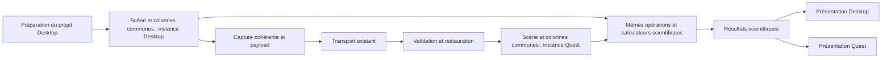

# Architecture cible et invariants

## Chemin commun

Les nœuds communs désignent les mêmes implémentations exécutées localement dans
chaque Player. Le diagramme ne prescrit pas un calculateur global partagé entre
processus ou une instance singleton entre plusieurs scènes.

## Responsabilités à séparer

| Responsabilité | Propriétaire cible | Contrat |
| --- | --- | --- |
| Identité de scène, collection et identité des colonnes | Socle scientifique commun | Accès stable, relations explicites ; aucun index UI comme identité. |
| Volumes, surfaces, sites et associations | Socle commun, avec propriétaires de ressources explicites | Une opération passe par le même accès sur les deux plateformes. |
| Paramètres et état scientifique d'une colonne | Colonne commune | Mutations validées, invalidation et notifications cohérentes. |
| Préparation et calcul densité/iEEG | Pipelines communs issus de 018–023 | Réutiliser le travail ; ne pas recopier les formules ou leur scheduling. |
| Résultats scientifiques et leur version | Socle commun | Résultats associés aux entrées ayant servi au calcul. |
| Import et préparation d'un projet | Adaptateur Desktop | Produit/adopte les données du socle sans importer son UI. |
| Décodage et restauration d'un contenu reçu | Adaptateur de chargement | Construit le même modèle et utilise les mêmes validations métier. |
| Caméras, vues, matériaux GPU, disposition, gizmos et entrées | Présentation Desktop ou Quest | Appelle les opérations communes ; aucun stockage scientifique autoritaire caché. |
| Connexion, progression réseau et acquittements | Transport et intégration applicative | Vie de connexion séparée de la vie du contenu. |

Conserver un socle compatible Unity est permis : le but n'est pas de produire
obligatoirement une bibliothèque .NET pure. En revanche, il doit fonctionner sans
caméra, toolbar, renderer Desktop, rig XR ou connexion. L'emploi de MonoBehaviour
pour le socle n'est accepté que si cela ne réintroduit pas ces dépendances.

## Invariants vérifiables

| ID | Invariant | Preuve attendue |
| --- | --- | --- |
| I01 | Les opérations métier accèdent à la même scène et aux mêmes colonnes, quelle que soit leur source. | Scène préparée et scène restaurée passent le même scénario avec la même API. |
| I02 | Le modèle fonctionne sans présentation Desktop ou Quest. | Test sans `View3D`, `Camera3D`, toolbar, renderer ni faux objets pour les remplacer. |
| I03 | L'état scientifique a une seule autorité par instance locale. | Pas de paramètres modifiables concurrents dans une vue, un DTO et une colonne ; graphe des propriétaires. |
| I04 | Les mutations de scène et de colonne déclenchent la même invalidation et le même recalcul. | Opération existante de scène choisie à l'audit et changement de rayon de colonne, via les mêmes APIs sur les deux sources ; colonnes concernées correctement invalidées. |
| I05 | Un résultat tardif ne remplace pas un résultat plus récent. | Calcul A puis mutation B, remplacement/fermeture pendant calcul ; publication attribuée à la bonne révision. |
| I06 | Les ressources scientifiques ne dépendent pas de la présence d'une vue. | Création/destruction d'un adaptateur de présentation sans libération accidentelle du modèle. |
| I07 | Une ressource partagée reste vivante tant qu'un consommateur valide en dépend. | Deux colonnes partageant une surface ; libération de l'une, usage puis libération de l'autre. |
| I08 | Les transforms de présentation ne modifient pas les entrées scientifiques. | Translation/rotation/échelle Quest ; coordonnées et distances scientifiques invariantes. |
| I09 | Le remplacement est transactionnel et le réseau n'est pas requis après réception. | Échec de restauration conservant la scène précédente ; calcul et fermeture après déconnexion. |
| I10 | Les modalités Desktop hors migration conservent leur comportement. | Inventaire des appels touchés et tests ciblés avant/après ; absence d'usage Quest non qualifié. |

## Données et état

Une scène possède ou référence explicitement les ressources nécessaires à ses
colonnes. Les métadonnées existantes, IDs et conventions sont réutilisés après
audit. Une colonne ne récupère pas son volume via un chemin alternatif propre au
Quest. Les résultats GPU peuvent être dérivés des données communes sans devenir
la source de vérité pour les calculs.

Desktop peut disposer d'une séquence entière quand le Quest ne reçoit qu'un
instant. Le modèle exprime cette disponibilité ; il ne fabrique pas les données
manquantes et n'introduit pas deux algorithmes. L'absence de données nécessaires
produit un résultat d'indisponibilité ou un refus explicite.

Les caches scientifiques sont dérivés et invalidés par leurs dépendances réelles.
Les masques peuvent varier entre colonnes : partager les données immuables ne
doit pas partager accidentellement des buffers natifs mutables ou les paramètres.
Les mutations et résultats ne sont pas stockés simultanément comme deux autorités
dans la scène commune et les classes historiques.

## Ressources et asynchronisme

L'audit identifie les propriétaires de volumes, surfaces, listes de sites, grilles,
générateurs, buffers et fichiers techniques. La stratégie peut être une propriété
par scène ou un mécanisme explicite de prêts ; aucun gestionnaire universel de
ressources n'est imposé. Adoption et copie des ressources Desktop doivent être
comparées : prévenir double libération et duplication inutile de grands volumes.

Annuler l'attente d'un calcul natif ne prouve pas sa terminaison. Les ressources
restent valides jusqu'à la fin réelle du travail qui les utilise. Une demande de
fermeture empêche les publications suivantes ; la libération respecte ce délai.
Les destructions Unity se font sur le thread requis. Pas de shutdown global du
runtime natif à la fermeture d'une seule scène.

Les abonnements de présentation ont une durée de vie explicite. Une vue retirée
ne continue pas à recevoir des résultats et une vue recréée peut consommer l'état
valide. La fermeture explicite de session libère le modèle ; la simple
déconnexion réseau ou disparition d'un renderer ne le fait pas.

## Migration des classes historiques

`Base3DScene`, `Column3D` et leurs dérivées sont les premiers points d'extraction,
pas des classes à copier dans un namespace Quest. Les éléments liés aux vues et
caméras vont vers les adaptateurs de présentation. Les données et opérations du
périmètre retenu restent ou deviennent communes.

Une façade Desktop temporaire peut préserver les callers et les assets sérialisés,
à condition de déléguer à l'état commun et d'avoir une sortie identifiée en
SCENE-007. Les autres modalités peuvent conserver leur orchestration historique
non migrée ; elles ne doivent pas recréer une deuxième branche pour la densité
ou l'iEEG migrées. Préserver les références de prefabs, GUID et données de projets
existants si des champs/types sérialisés sont déplacés.

## Exemple de preuve d'extension

Sur une colonne densité, modifier le rayon d'influence par l'opération commune,
attendre directement sa terminaison et lire le résultat par la même API. Exécuter
ce scénario sur une scène préparée Desktop puis sur sa restauration, sans UI.
Vérifier état, invalidation, résultat et ressources. Le test ne doit pas appeler
directement le calculateur en contournant la scène et la colonne.

Ce scénario utilise une fonction existante ; il n'autorise ni l'ajout de coupes
ni la construction d'un système générique de commandes pour anticiper celles-ci.

Une seconde preuve porte sur une opération existante de scène, choisie à l'audit,
par exemple un remplacement de référence surface/volume avec des données de test
disponibles dans les deux scènes. Elle passe par la même API sur les instances
préparée et restaurée et vérifie l'invalidation des colonnes concernées. Un simple
conteneur de colonnes commun ne prouve pas que l'orchestration de scène est commune.
