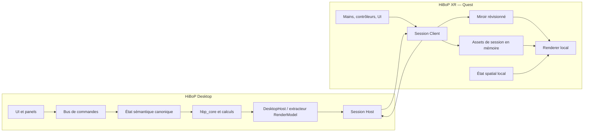

# HiBoP XR — architecture technique

**Version :** 0.4
**Décision :** deux projets Unity, monorepo applicatif, calcul Desktop et rendu Quest local

## 1. Architecture logique



Le Desktop ne rend pas pour le Quest. Il publie l'état et les résultats minimaux nécessaires au renderer local. Le Quest ne charge pas les fichiers source et n'exécute pas les workflows scientifiques.

## 2. Déploiement

```text
Monorepo applicatif HiBoP
  /Assets/                    code et assets Desktop
  /Packages/                  manifest/lock Desktop
  /ProjectSettings/           settings Desktop
  /Shared/Packages/
    com.crnl.hibop.contracts/
    com.crnl.hibop.render-model/
    com.crnl.hibop.protocol/
  /XR/                        second projet Unity
    /Assets/                  code, scènes et assets XR
    /Packages/                manifest/lock XR
    /ProjectSettings/         settings XR

Repo hbp_core
  bibliothèque native, releases et tests propres
```

P01 conserve le projet Desktop à la racine et ajoute le second projet sous `XR/`, sans déplacer ni copier le code HiBoP existant. Les trois packages locaux sont consommés par chemins `file:` relatifs et verrouillés séparément dans chaque projet. Les scènes, prefabs de rig, settings et UI spécifiques restent dans leur projet. Un shader, matériau ou renderer ne devient partagé qu'après avoir démontré qu'il est réellement consommé et testé par les deux projets.

Le build Desktop standard ne doit embarquer que le pont et le point d'entrée XR nécessaires. Le host, les runtimes self-contained et les assets volumineux sont distribuables comme module optionnel, sauf si leur intégration complète est mesurée comme négligeable par rapport au build. HiBoP lance et supervise ce module lorsqu'il est installé ; l'utilisateur ne lance jamais manuellement un second programme.

## 3. Matrice de topologie

Scores de 1 (défavorable) à 5 (favorable).

| Critère | Poids | Projet unique | 2 projets, monorepo | 2 repos applicatifs |
| --- | ---: | ---: | ---: | ---: |
| isolation plugins/settings | 5 | 2 | 5 | 5 |
| changements atomiques | 5 | 5 | 5 | 2 |
| absence de dérive | 5 | 5 | 5 | 2 |
| CI/builds indépendants | 4 | 2 | 5 | 5 |
| partage d'assets | 4 | 5 | 4 | 2 |
| simplicité initiale | 2 | 4 | 3 | 2 |
| permissions/releases séparées | 2 | 1 | 3 | 5 |
| score pondéré |  | 90 | **129** | 89 |

Le prototype HoloLens correspondait à la dernière colonne sans packages versionnés : il a dérivé. Le fallback deux repos n'est justifié que par une contrainte d'organisation concrète.

## 4. Frontières de modules

### 4.1 Packages partagés

`com.crnl.hibop.contracts` — assembly `CRNL.HiBoP.Contracts`

- IDs opaques et stables ;
- scopes, commandes, erreurs, snapshots et révisions ;
- types C# purs, AOT-safe, sans Unity, IO, UI ni native.

`com.crnl.hibop.render-model` — assembly `CRNL.HiBoP.RenderModel`

- descripteurs de surfaces, sites, coupes, matériaux et panels ;
- buffers typés et unités/repères ;
- résultats complets et dépendances d'assets.

`com.crnl.hibop.protocol` — assembly `CRNL.HiBoP.Protocol`

- handshake, enveloppes, framing, compatibilité, codecs ;
- aucune dépendance au SDK Meta ;
- tests de round-trip et fuzz/property tests.

La baseline ne contient aucun package `Rendering` partagé : P05 place son renderer sous `XR/Assets/`. Toute extension future de `Shared/Packages/` au-delà des trois packages décidés exige une réouverture explicite de D03 et un ADR distinct.

### 4.2 Adaptateurs Desktop

Ils restent sous `Assets/` et ne modifient pas les modèles HiBoP pour leur ajouter des méthodes DTO.

- projection des modèles `HBP.Core/Data` vers les contrats ;
- validation et exécution des commandes ;
- orchestration `hbp_core` ;
- extraction des résultats après calcul ;
- gestion de session, snapshots complets et cache d'assets ;
- journal de deltas seulement comme optimisation optionnelle négociée.

### 4.3 Client Quest

Il reste sous `XR/Assets/`.

- transport, appairage et reconnexion ;
- miroir d'état strictement révisionné ;
- cache en mémoire indexé par hash ;
- renderer, picking et état spatial ;
- OpenXR/XRI et adaptateurs Meta.

## 5. Pourquoi Core/Data ne traversent pas la frontière

`HBP.Core.Runtime` et `HBP.Data.Runtime` entraînent aujourd'hui accès fichiers/base de données, persistentDataPath, TMPro/UI, globals, wrappers `hbp_core`, `hbp_math` et `EEGFormat`, renderer et dépendances Desktop. Les compiler partiellement avec des gardes plateforme créerait un client fragile et surdimensionné.

L'extraction suit la règle : dépendances vers l'intérieur.

```text
Desktop Core/Data ---> Contracts + RenderModel <--- Quest
DesktopHost --------> Protocol <-------------- XR Client
```

Les contrats ne référencent aucun shell. Les adaptateurs peuvent référencer les contrats.

## 6. Calcul et fidélité

### 6.1 Projection dynamique

Le Desktop :

1. reçoit/produit un temps logique ;
2. choisit `TemporalSample(Index, Alpha)` ;
3. calcule la projection canonique ;
4. extrait les scalaires/masques/attributs de sites ;
5. publie un bundle lié aux révisions d'entrée.

Le Quest reconstruit uniquement les attributs shader. Il ne reçoit pas par défaut signaux sources, matrices patient complètes, volume temporel ou champ de projection.

Pour la timeline V1, ces résultats post-projection sont calculés/préparés en amont pour tous les indices admis, transférés une fois et conservés en mémoire Quest. Le changement d'index sélectionne ensuite localement une tranche déjà résidente et doit être visible à la frame XR suivante. Il n'existe aucune constante de cardinalité : l'admission se fait en octets CPU/GPU réellement contrôlés, après déduplication et partage.

Une divergence potentielle du code actuel doit être fermée : les sites utilisent l'alpha temporel, tandis que le chemin surface observé ne le transmet pas explicitement. La baseline scientifique de l'extraction est définie par un test attendu, pas par le bug éventuel.

### 6.2 Coupes

- plan/gizmo local pour feedback immédiat ;
- calcul exact Desktop ;
- géométrie et texture anatomique transférées lorsqu'elles changent ;
- résultat final de coupe calculé sur Desktop puis transféré ;
- overlays par colonne inclus dans le preload temporel si le plan est stable ;
- résultat atomique et latest-wins.

### 6.3 `hbp_core` sur Quest

Le build Android ARM64 est techniquement possible à la révision auditée, mais non qualifié sur Quest. V1 ne l'exige pas. Un backend local ciblé est une contingency pour la coupe uniquement si réseau/latence échouent et que P/Invoke, parité, mémoire et thermique passent.

## 7. Assets et instances

`SurfaceAsset` est immuable : positions, normales, indices, repère, unités, bounds, variantes et hash. Plusieurs `BrainInstance` le référencent. Chaque instance contient transformation XR locale, visibilité et liaisons de colonnes. Chaque colonne possède uniquement ses buffers dynamiques et propriétés de matériau.

Les sites suivent le même principe :

- `SiteAsset` : positions, IDs et métadonnées nécessaires ;
- `SiteRenderFrame` : couleur, taille, masque/visibilité et états ;
- index spatial construit une fois par asset/repère ;
- picking renvoie l'ID, jamais un index local non versionné.

## 8. Repères et unités

Tous les assets déclarent :

- unité source et facteur vers mètre Unity ;
- handedness ;
- ordre des axes ;
- matrice asset → brain ;
- bounds et origine ;
- version de mapping.

Transformations :

```text
point source
  -> assetToBrain canonique
  -> BrainInstance pose/scale locale
  -> world XR
```

Le Desktop ne reçoit une pose XR que si une fonction métier l'exige. La disposition ordinaire reste locale.

## 9. État et invalidation

```text
ProjectPersistentState       Desktop, fichier projet
SharedSemanticState          Desktop, autorité de session
DesktopPresentationState     Desktop seulement
XRPresentationState          Quest seulement
RenderMirror                 Quest, dérivé et révisionné
```

Chaque commande déclare son scope et sa `baseScopeRevision`. Le Desktop renvoie acceptation/rejet, delta d'état et résultats corrélés. Un résultat cite toutes ses révisions d'entrée ; le client ne l'applique que si elles correspondent encore.

Le Quest peut présenter un feedback local `pending`, notamment pour les transformations, la sélection et un index temporel résident. La valeur Desktop validée reste canonique et tout rejet produit un rollback explicite. Une coupure réseau ne bloque jamais tracking, passthrough, perspective ou transformations locales ; elle gèle seulement les commandes et évolutions scientifiques.

## 10. Concurrence et pression

- file de contrôle prioritaire ;
- assets bulk isolés des commandes ;
- un calcul/transfert actif et un pending latest maximum par interaction dynamique ;
- annulation coopérative lorsque possible ;
- rejet précoce des résultats stale ;
- pools de buffers et uploads GPU groupés ;
- aucun callback réseau ne modifie directement des objets Unity hors main thread ;
- snapshots appliqués transactionnellement.

L'admission d'une timeline, d'un cerveau ou d'une coupe estime avant transfert les coûts CPU/GPU et refuse uniquement la nouvelle ressource si le budget sûr serait dépassé. Les ressources existantes ne sont ni tronquées ni évincées silencieusement. Le paging disque/réseau de données scientifiques n'appartient pas à la V1.

## 11. OpenXR et Meta

Le projet XR utilise OpenXR, Input System, XRI et XR Hands. Meta OpenXR/Core fournit le passthrough et les extensions nécessaires derrière `IXRPlatformCapabilities` et `IPassthroughProvider`. Le SDK Meta ne doit pas contaminer contrats, protocole ou renderer générique.

## 12. Échec et observabilité

Le host expose des diagnostics sans données patient :

- version/capabilities ;
- état de connexion et raison de fermeture ;
- RTT et débit par canal ;
- révisions envoyées/appliquées/rejetées ;
- profondeur des files et taux de coalescence ;
- temps calcul/sérialisation/transfert/décodage/upload ;
- mémoire de cache par type d'asset ;
- pour tout refus de ressources : octets requis/permis, cardinalités et principaux contributeurs.

Un identifiant de corrélation permet de tracer une commande sans nom patient ni payload. Les erreurs sont typées : auth, compatibilité, state conflict, asset missing, compute failed, resource pressure et transport.

## 13. Gates architecturales

1. Les deux projets consomment un même package local sans copie.
2. Contracts/Protocol passent des tests AOT/IL2CPP.
3. Un renderer indépendant reproduit une image Desktop depuis `RenderModel`.
4. Le serveur se build et fonctionne d'abord sur Windows x64, puis sur macOS Apple Silicon — MacBook Air M2 inclus — et Ubuntu 24.04 x64.
5. Le client Quest se reconnecte par snapshot complet sans état mixte ; les deltas sont un bonus négocié.
6. 37 500 sites utilisent buffers/index spatial.
7. Une surface MNI est partagée entre instances.
8. Aucune donnée patient n'est écrite sur le Quest.
9. Le déplacement de tête autour d'un cerveau agrandi et ses manipulations locales restent fluides à 72 Hz.
10. Le poids marginal XR du build standard et du module optionnel est mesuré avant décision d'intégration finale.
